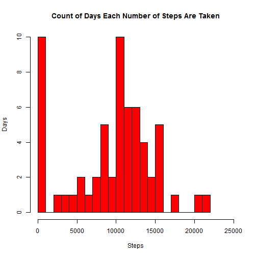
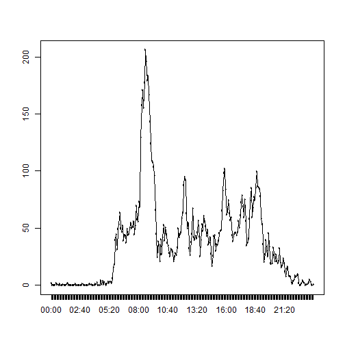
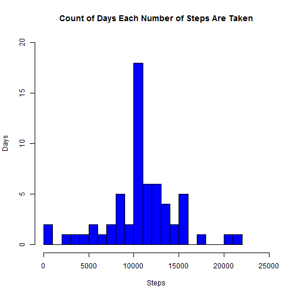
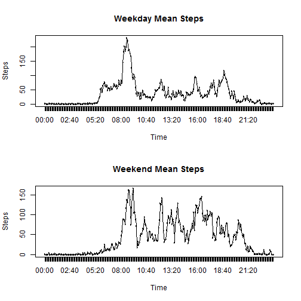

---
title: 'Reproducible Research: Peer Assessment 1'
output:
  html_document:
    keep_md: yes
---

## Loading necessary packages 
Please ensure that the activity.csv file is in the working directory.

```r
if(!require("reshape")){
        install.packages("reshape")
        }
library(reshape)
```
## Loading and preprocessing the data

```r
x<-read.csv("~/activity.csv")
x$date<-as.Date(x$date)#converts date column to date data type
x$interval<-sprintf("%04d",x$interval)#converts "interval column to 4 characters"
x$interval<-format(strptime(x$interval, format="%H%M"), format = "%H:%M")#converts interval to time
```
## What is the mean total number of steps per day?

The sum total of steps each day is:


```r
narm<-tapply(x$steps,x$date,sum,na.rm=TRUE)#sums the data by date and removes NAs 
print(narm)#prints data
```

```
## 2012-10-01 2012-10-02 2012-10-03 2012-10-04 2012-10-05 2012-10-06 
##          0        126      11352      12116      13294      15420 
## 2012-10-07 2012-10-08 2012-10-09 2012-10-10 2012-10-11 2012-10-12 
##      11015          0      12811       9900      10304      17382 
## 2012-10-13 2012-10-14 2012-10-15 2012-10-16 2012-10-17 2012-10-18 
##      12426      15098      10139      15084      13452      10056 
## 2012-10-19 2012-10-20 2012-10-21 2012-10-22 2012-10-23 2012-10-24 
##      11829      10395       8821      13460       8918       8355 
## 2012-10-25 2012-10-26 2012-10-27 2012-10-28 2012-10-29 2012-10-30 
##       2492       6778      10119      11458       5018       9819 
## 2012-10-31 2012-11-01 2012-11-02 2012-11-03 2012-11-04 2012-11-05 
##      15414          0      10600      10571          0      10439 
## 2012-11-06 2012-11-07 2012-11-08 2012-11-09 2012-11-10 2012-11-11 
##       8334      12883       3219          0          0      12608 
## 2012-11-12 2012-11-13 2012-11-14 2012-11-15 2012-11-16 2012-11-17 
##      10765       7336          0         41       5441      14339 
## 2012-11-18 2012-11-19 2012-11-20 2012-11-21 2012-11-22 2012-11-23 
##      15110       8841       4472      12787      20427      21194 
## 2012-11-24 2012-11-25 2012-11-26 2012-11-27 2012-11-28 2012-11-29 
##      14478      11834      11162      13646      10183       7047 
## 2012-11-30 
##          0
```
The histogram below is divided by groups of 1000 steps and shows how many days the subject took that many steps.

```r
hist(narm,breaks=25,xlab="Steps",ylab="Days",main="Count of Days Each Number of Steps Are Taken",xlim=c(0,25000),col="Red")#creates histogram of days each steps are walked with buckets of 1000 steps.
```

 

The mean number of steps per day is:


```r
mean(narm)#gives the mean number of steps perday since narm is already the sum total of steps by date.
```

```
## [1] 9354.23
```
The median number of steps per day is:

```r
median(narm)#gives the median number of steps per day
```

```
## [1] 10395
```
## What is the average daily activity pattern?

```r
intmean<-tapply(x$steps,x$interval,mean,na.rm=TRUE)
meltint<-melt(intmean)#creates a 2 column data frame of the means per interval
colnames(meltint)<-c("Time","Steps")#renamed columns to improve readability of code


plot(meltint$Time,meltint$Steps,type="n")#creates time series plot
lines(meltint$Time,meltint$Steps,type="l")
```

 
The time with the average maximum steps is: 

```r
int<-which.max(meltint$Steps)
print(meltint[int,])
```

```
##      Time    Steps
## 104 08:35 206.1698
```
## Imputing missing values
Here we can see that the total number of na values is as follows:

```r
sum(is.na(x$steps))
```

```
## [1] 2304
```
We will replace these nas by matching the means of the steps for the days we have values via their time intervals to the days that have no steps..  

```r
xm<-merge(x,meltint,by.x="interval",by.y="Time") #merges data frames on interval
xm<-xm[order(xm$date),] #because merge sorts the data it is again reordered by date. 
for(i in 1:nrow(xm)){ #iterates through the dataset looking for Nas and replacing them with the equivelant mean from the new column we created.
        if( is.na(xm$steps[i]) == TRUE){
                xm$steps[i] <- xm$Steps[i]#the columns are named similarly but the new column with means is capitalized to prevent confusion
                }
        }
xm[,4]<-NULL #Once the replacement is complete the column of means is removed leaving a duplicate data set to the first with the NAs filled in by the interval means
```
Then we will sum the steps for each day and produce a histogram that can be compared to the histogram from the old data set:  

```r
xms<-tapply(xm$steps,xm$date,sum)#sum the steps and don't worry about NAs since there are none now.
hist(xms,breaks=25,xlab="Steps",ylab="Days",main="Count of Days Each Number of Steps Are Taken",xlim=c(0,25000), ylim=c(0,20),col="Blue")#The new histogram
```

 

Here is the mean for the new data set:


```r
mean(xms)
```

```
## [1] 10766.19
```

And here is the median for the new data set:


```r
median(xms)
```

```
## [1] 10766.19
```


We can see that the new histogram looks quite different from the old one since the NAs have been replaced with the means from each day. The new mean and median have now risen to reflect the addition of the mean data. And the new mean is And the mean is now actually the mean of the mean for the day.

## Are there differences in activity patterns between weekdays and weekends?

```r
weekday<-weekdays(xm$date) #creates a new vector of day names based on the dates
datetime<-cbind(weekday, xm)#binds the new vector of names to the existing data
weekend<-subset(datetime, weekday=="Sunday"| weekday=="Saturday")#creates new df with weekend days
weekdays<-subset(datetime, weekday!="Sunday"& weekday!="Saturday")#creates new df with weekday days
weekend$weekday<-"Weekend"#removes day names and labels them as either weekday or weekend depending on which one they are.
weekdays$weekday<-"Weekday"
weekendmean<-tapply(weekend$steps,weekend$interval,mean)#means the steps per interval for weekends.
meltend<-melt(weekendmean)#melts the df for easier plotting
weekdaymean<-tapply(weekdays$steps,weekdays$interval,mean)#means the steps per interval for weekdays.
meltday<-melt(weekdaymean)#melts the df for easier plotting
par(mfrow=c(2,1))#creates vertical panel plot for weekend and weekday mean activity.
plot(meltday$indices,meltday$value,type="n",main="Weekday Mean Steps",xlab="Time",ylab="Steps")
lines(meltday$indices,meltday$value,type="l")
plot(meltend$indices,meltend$value,type="n",main="Weekend Mean Steps",xlab="Time",ylab="Steps")
lines(meltend$indices,meltend$value,type="l")
```

 

```r
datetime<-rbind(weekdays,weekend) #reintegrates data into single data set for further study.
datetime<-datetime[order(datetime$date),]#reorders data by date rather than by weekday weekend.
```

There is obviously a difference in distribution and intensity between weekday and weekend steps by hour. 
